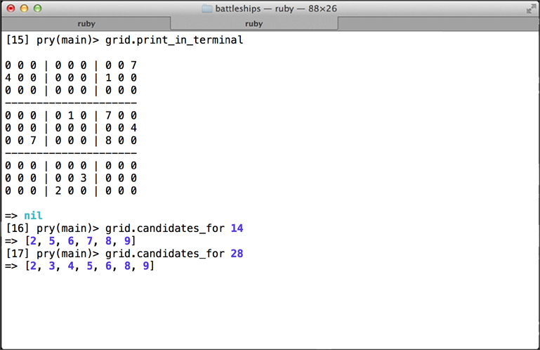
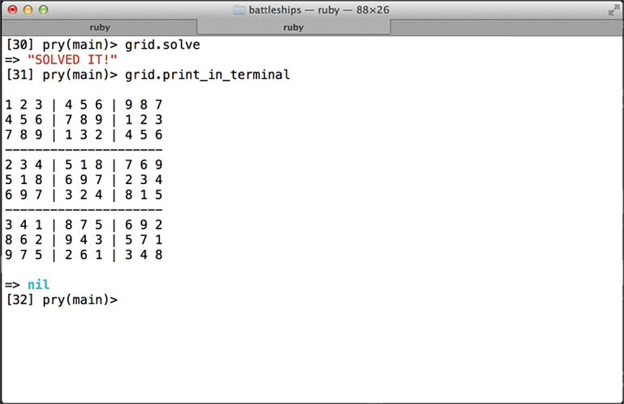
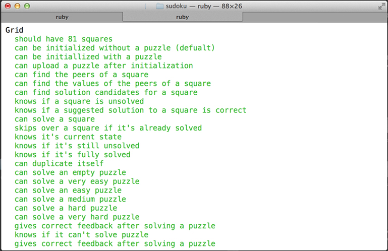

#SUDOKU

[](https://codeclimate.com/github/nadavmatalon/sudoku)

## Table of Contents

* [Screenshots](#screenshots)
* [General Description](#general-description)
* [What is Soduko](#what-is-soduko)
* [Functional Description](#functional-description)
* [How to Install and Run Locally](#how-to-install-and-run-locally)
* [Testing](#testing)
* [License](#license)


##Screenshots

<table>
	<tr>
		<td align="center" width="190px">
			<a href="https://raw.githubusercontent.com/nadavmatalon/sudoku/master/images/sudoku_1.jpg">
				<br/>
				  A New Puzzle
			</a>
		</td>
		<td align="center" width="190px">
			<a href="https://raw.githubusercontent.com/nadavmatalon/sudoku/master/images/sudoku_2.jpg">
				<br/>
				 Solving the Puzzle
			</a>
		</td>
		<td align="center" width="190px">
			<a href="https://raw.githubusercontent.com/nadavmatalon/sudoku/master/images/sudoku_3.jpg">
				<br/>
				 Testing
			</a>
		</td>
	</tr>
</table>


##General Description

This app implements the logic for the game of __Sudoku__.

It was written following the course at 
[Makers Academy](http://www.makersacademy.com/) 
as an exercise in buiding the back-end logic of an app with 
[Ruby 2.1](https://www.ruby-lang.org/en/) using
[TDD](http://en.wikipedia.org/wiki/Test-driven_development) 
methodology (tests written with [Rspec](http://rspec.info/)).

__Update (14.11.14)__ : I've re-written the app from scratch 
to generate a more cohesive and cleaner code.


##What is Soduko

Here's a brief description of the game:

>__Sudoku__ is a logic-based combinatorial number-placement puzzle. 
>
>The objective is to fill a grid made of 9x9 `squares` (81 in total) with digits  
>so that each `column`, each `row`, and each `box`* contains all of the digits 
>from 1 to 9. 
>
>The puzzle setter provides a partially completed grid, which may have a unique 
>solution or several possible solutions.
>
> \* The grid contians 9 so-called 'boxes', that is 3x3 sub-grids within the general grid.

(Source: [Wikipedia on Sudoku](http://en.wikipedia.org/wiki/Sudoku))


##Functional Description

The code offers the following main UI functions:<br/>
(see the [How to Install and Run Locally](#how-to-install-and-run-locally) 
section below for a detailed account of the code's classes and methods):
* Creating a new Soduko grid (empty or with a new puzzle)
* Uploading new puzzles - difficulty levels ranging from 'Very Easy' to 'Very Hard' (1-5)
* Printing the grid's current state in the terminal
* Generating a complete solution for the puzzle


##How to Install and Run Locally

To run the code in terminal, clone the repo locally and run:

```bash
$> cd sudoku
$> bundle install
$> irb
>> require './lib/grid.rb'
```

After that, you can use the following main constructors and methods for 
the __Grid__ class

(additional supporting classes and methods can be found in the code itself):


###Grid Class

The Grid class contains the following `constructors` and `instance methods`:

| Constructor  | Description                                                      |
|----------|-----------------------------------------------------------------------|
| Grid.new | returns a new (empty) instance of a grid with 9x9 squares             |
| Grid.new(puzzle) | returns a new instance of a grid with a pre-loaded puzzle (see definition of a 'puzzle' below) | 

| Method  | Description                                                            |
|----------|-----------------------------------------------------------------------|
| .upload(puzzle) | uploads a provided puzzle to the grid                          |
| .upload_new_puzzle(level) | uploads a new puzzle to a grid (level of difficulty can be specified between 1-5; default is: 3) |
| .get_value_at(index) | returns the value of the square at the specified index (0-80) | 
| .set_value_at(index, value) | sets the value of the square at the specified index (0-80) | 
| .solve_at(index) | attempts to solve the square at the specified index (0-80)    | 
| .solve_puzzle   | generates a complete solution for the puzzle                   |
| .str_for_print  | returns a string of the current state of the grid's puzzle formatted for prining in the terminal |
| .puzzle_to_str | returns a String with the current state of the grid's puzzle    |
| .fully_solved? | returns a boolean (true => grid is fully solved ; false => it's not) |
| .candidates_for(index) | returns an Array with possible solutions to a square at a specified index (0-80) | 

* A `puzzle` is a String with 81 chars (each char must have value of 0-9).

Here are three example of `puzzle-strings` you can use when playing with the above methods:

```ruby
easy_puzzle =   '015003002000100906270068430490002017501040380003905000900081040860070025037204600'

medium_puzzle = '000200001060075000057004060900000608000080000005630040500003000002000930708000014'

hard_puzzle =   '800000000003600000070090200050007000000045700000100030001000068008500010090000400'
```

```

##Testing

Tests were written with [Rspec](http://rspec.info/) (3.1.0).

To run the testing suite in terminal, clone the repo and run: 

```bash
$> ch sudoku
$> rspec
```

##License

<p>Released under the <a href="http://www.opensource.org/licenses/MIT">MIT license</a>.</p>

